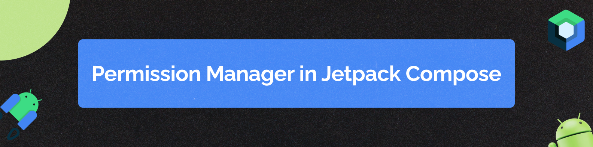

## Compose Permission Manager



A lightweight Android library that simplifies runtime permission management in Jetpack Compose
applications. This library provides a composable API to request, check, and handle app permissions
with ease. It supports custom rationale and settings dialogs, manifest permission validation, and
lifecycle-aware permission flows.


 

[](https://central.sonatype.com/artifact/com.meticha/permissions_compose)


## Features

- **Composable Permission State**: Easily manage permissions with a stateful, composable API.
- **Manifest Check**: Automatically verifies that all required permissions are declared in your
  app’s manifest.
- **Customizable UI**: Configure custom rationale and settings dialogs to match your app’s style.
- **Lifecycle Aware**: Automatically handles permission requests on lifecycle changes (e.g., when
  resuming from app settings).
- **Flexible Permission Flow**: Seamlessly handles both required and optional permissions.

## Installation

You can follow the implementation approach used in the app module. Alternatively, you can find a
detailed explanation below.

### Dependencies

The library is now available on MavenCentral!!! Add the dependencies to your libs.versions.toml

```
[versions]
...
permissionsCompose = "X.X.X" current release version

[libraries]
...
permissions-compose = { group = "com.meticha", name = "permissions_compose", version.ref = "permissionsCompose" }

```

In your build.gradle.kts implement your dependencies:

```
...
dependencies {
...
 implementation(libs.permissions.compose)
```

## Usage

### 1. (OPTIONAL) Setup in MainActivity

Set for configuring the custom UI for permission rationales (if desired)

```kotlin
class MainActivity : ComponentActivity() {
    override fun onCreate(savedInstanceState: Bundle?) {
        super.onCreate(savedInstanceState)

        // Set a custom rationale UI globally
        PermissionManagerConfig.setCustomRationaleUI { permission, onDismiss, onConfirm ->
            CustomRationaleDialog(
                description = permission.description,
                onDismiss = onDismiss,
                onConfirm = onConfirm
            )
        }

        setContent {
            DemoApplicationTheme {
                PermissionScreen()
            }
        }
    }
}
```

### 2. Implement a Permission Screen

Use the `rememberAppPermissionState` composable to manage your permissions within a Jetpack Compose
screen.

```kotlin
@Composable
fun PermissionScreen() {
    val permissions = rememberAppPermissionState(
        permissions = listOf(
            AppPermission(
                permission = Manifest.permission.CAMERA,
                description = "Camera access is needed to take photos. Please grant this permission.",
                isRequired = true
            ),
            AppPermission(
                permission = Manifest.permission.RECORD_AUDIO,
                description = "Microphone access is needed for voice recording. Please grant this permission.",
                isRequired = false
            ),
            AppPermission(
                permission = Manifest.permission.READ_CONTACTS,
                description = "Contact access is needed to show the contacts in the App. Please grant this permission",
                isRequired = true
            )
        )
    )

    Column(
        modifier = Modifier
            .fillMaxSize()
            .padding(16.dp),
        horizontalAlignment = Alignment.CenterHorizontally,
        verticalArrangement = Arrangement.Center
    ) {
        // Display current permission statuses
        Text("Camera Permission: ${if (permissions.isGranted(Manifest.permission.CAMERA)) "Granted" else "Not Granted"}")
        Text("Audio Permission: ${if (permissions.isGranted(Manifest.permission.RECORD_AUDIO)) "Granted" else "Not Granted"}")
        Text("Contact Permission: ${if (permissions.isGranted(Manifest.permission.READ_CONTACTS)) "Granted" else "Not Granted"}")

        Button(
            onClick = { permissions.requestPermission() },
            modifier = Modifier.padding(top = 16.dp)
        ) {
            Text("Request Permissions")
        }

        // Show content conditionally based on permission state
        if (permissions.allRequiredGranted()) {
            Text("All required permissions granted! You can now use the app.")
        }
    }
}
```

## How It Works

### PermissionState

The core of the library is the PermissionState class, which:

- Maintains the list of all and pending permissions.
- Tracks the current permission being requested.
- Manages UI state for displaying rationale and settings dialogs.
- Progresses through the permission request queue using functions such as requestPermission() and
  next().

## Lifecycle Integration

The `PermissionLifeCycleCheckEffect` composable observes lifecycle events (e.g., `ON_RESUME`). If
the app resumes from settings, it automatically re-triggers the permission request flow.

## Manifest Verification

Before launching a permission request, the library verifies that each permission is declared in your
`AndroidManifest.xml`. If a permission is missing, a `PermissionNotAddedException` is thrown to
alert
you.

## Customization

You can customize the permission dialogs globally via the `PermissionManagerConfig`:

```kotlin
PermissionManagerConfig.setCustomRationaleUI { permission, onDismiss, onConfirm ->
    // Provide your custom rationale UI implementation here
}
```

Similarly, custom settings dialogs can be implemented if needed. This flexibility allows you to
tailor the user experience to match your app's design guidelines.

# Contributing

Contributions are welcome! If you have suggestions, improvements, or bug fixes, please open an issue
or submit a pull request. Make sure to follow the existing code style and include tests where
applicable.

# License

Distributed under
the [Apache Software License, Version 2.0.](https://www.apache.org/licenses/LICENSE-2.0)


